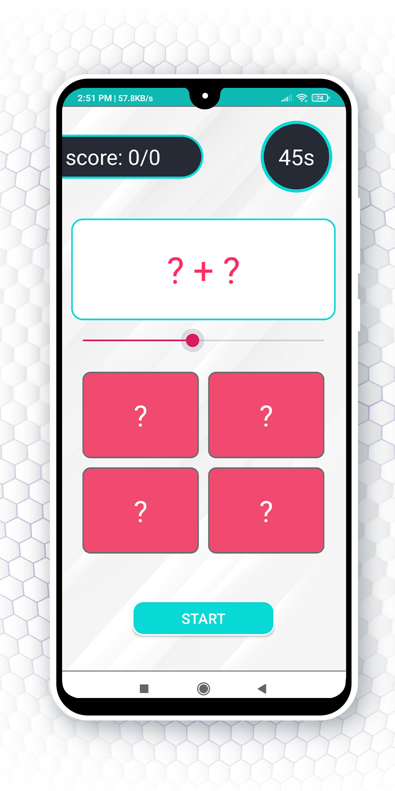
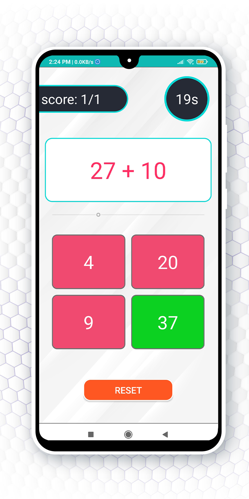
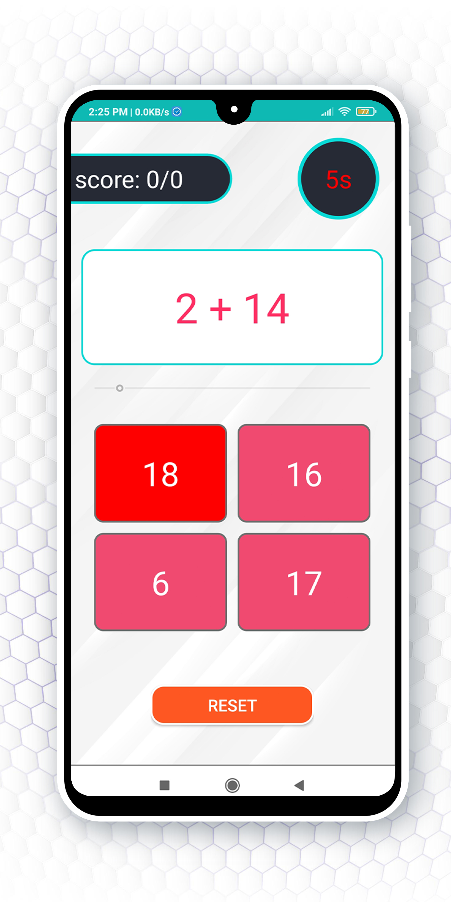

# Brain Training

## Brian Training  is a native android application for simple math problems with a timer and some animations

 

---

<table style="width:100%" >
  
  <tr> 
   <th>   <h2>Home Screen</h2>   </th> 
  <tr/>
  <tr>
    <th></th>
  </tr>
  

  <tr>  
   <th>   <h2>PrePlay Screen</h2> </th>
  <tr/>
  <tr>
   <th></th>
  </tr>
  
 
  <tr>  
   <th>   <h2>Set Timer</h2> </th>
  <tr/>
  <tr>
   <th></th>
  </tr>
  
  
  <tr>  
   <th>   <h2>True Answer</h2> </th>
  <tr/>
  <tr>
   <th></th>
  </tr>
  
  
  <tr>  
   <th>   <h2>False Answer</h2> </th>
  <tr/>
  <tr>
   <th></th>
  </tr>
  
   
   
  <tr>  
   <th>   <h2>Score Screen</h2> </th>
  <tr/>
  <tr>
   <th></th>
  </tr>

  
</table>

---

# Brain Training video

 

---
## Social Links 

 
 
  
   
  

---
